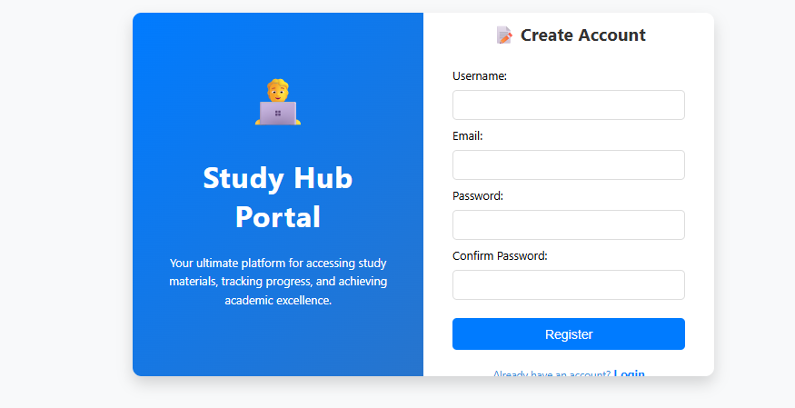
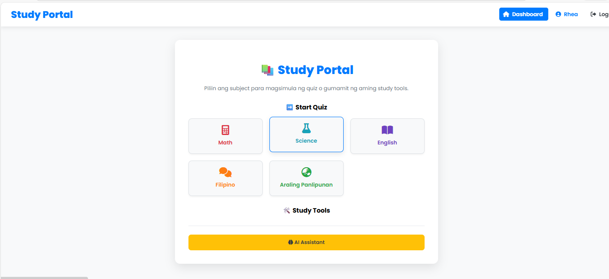
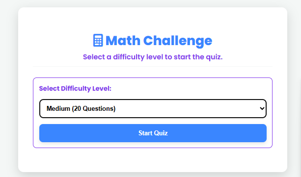
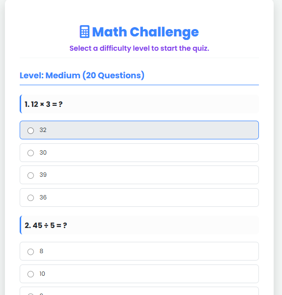

 📚 Study Portal: Web-Based Learning Platform

 🌟 Project Title
Study Portal: Web-Based Learning Platform

 📝 Description

The Study Portal is a dynamic web application designed to be a centralized hub for students to test their knowledge and utilize simple study tools. Built primarily with PHP and utilizing a MySQL database, the platform features a secure user login system, a personalized dashboard, and subject-specific quizzes. A key feature is the integration of a Simple Question Responder (an early-stage AI Assistant) that provides instant, keyword-based answers to study-related queries.

 ✨ Features

Secure User Authentication:Implements a full authentication flow (Login/Logout) using PHP sessions and database verification.
Dynamic Routing: Uses a single `index.php` file to intelligently manage navigation between the Dashboard, Profile, and other core pages.
Personalized Dashboard: Displays links to various subject quizzes (Math, Science, English, Filipino, Araling Panlipunan) and study tools.
User Profile Management: Users can view their account details (username, email, date joined) fetched securely from the database.
Simple Question Responder: A foundational AI Assistant tool that uses advanced string matching techniques (keyword-based logic) to provide quick factual answers related to science, math, and general knowledge queries in Filipino and English.
Modular Design: Quiz subjects are linked to separate files (e.g., `science.php`) for easy expansion and content management.

 💡 Emerging Technology Used

The primary emerging technology demonstrated in this project is the conceptual implementation of an AI Assistant using fundamental PHP logic:

 Simple Natural Language Processing (via Keyword Matching): Instead of using complex machine learning models, the project simulates an AI-like response capability. It leverages keyword analysis (`strpos`) and extensive data arrays to understand the user's intent and retrieve contextually relevant information. This represents an accessible, low-resource approach to creating early-stage **Intelligent Tutoring Systems**.
Secure Data Handling (PDO): The use of **PHP Data Objects (PDO)** demonstrates adherence to modern best practices for database interaction, utilizing prepared statements to protect against common security vulnerabilities like SQL Injection.

## 🚀 Installation Steps / How to Run the Project

This project requires a standard LAMP/WAMP/MAMP stack environment.

### Prerequisites

1.  Web Server: XAMPP
2. PHP Version: PHP 7.4 or higher.
3.  Database: MySQL.

 Setup Instructions

1.  **Database Creation:**
    * Open your MySQL administration tool (e.g., phpMyAdmin).
    * Create a new database named **`study_portal`**.
    * Execute the following SQL query to create the `users` table:
        ```sql
        CREATE TABLE users (
            id INT AUTO_INCREMENT PRIMARY KEY,
            username VARCHAR(50) NOT NULL UNIQUE,
            email VARCHAR(100) NOT NULL UNIQUE,
            password_hash VARCHAR(255) NOT NULL,
            created_at DATETIME DEFAULT CURRENT_TIMESTAMP
        );
        ```
2.  File Placement:
    Save all PHP files (`index.php`, `auth.php`, `whats_on_your_mind.php`, etc.) inside the web root directory (e.g., `C:\xampp\htdocs\Study-Portal-Project`).
3.  Server Start:
     Ensure your Apache and MySQL services are running.
4.  Access the Portal:
    Open your web browser and navigate to the authentication page:
        ```
        http://localhost/Study-Portal-Project/auth.php
        ```
    Register a new user, and you will be automatically redirected to the dashboard (`index.php`).

## 🖼️ Screenshots or Sample Output

(Please replace the following lines with actual images of your project)

1. Authentication Page (Login/Register):


2. Dashboard (index.php):


3. Simple Question Responder (whats_on_your_mind.php):



🧑‍💻 Developer Information


| **Developer** | Rhea Mae N. Ramos | [rheamramos14@gmail.com] |
| **Course** |  BSIT | |
